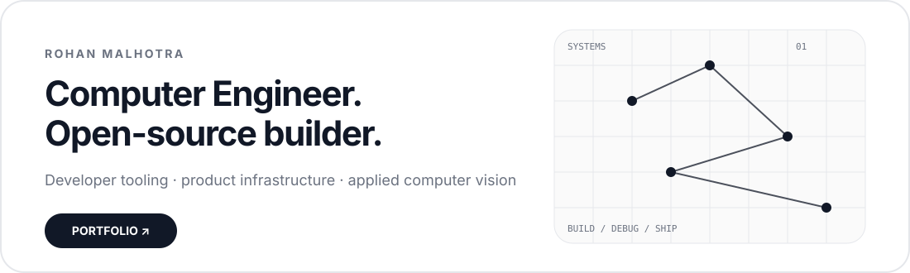
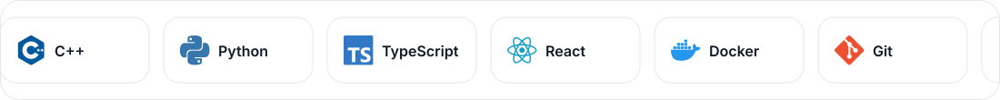
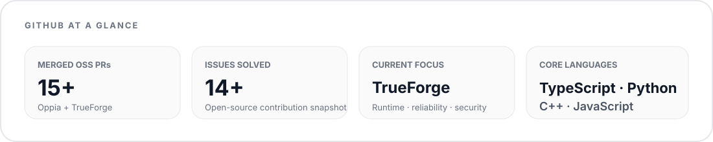
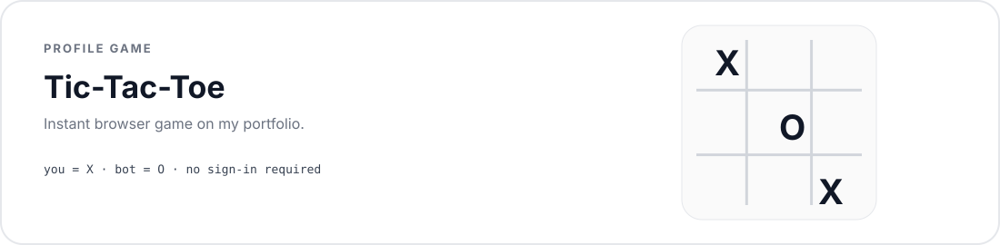

 

## Tools & Technologies I work with

 

## GitHub stats

 

## Open source

| TrueForge / TrueFoundry | Oppia Foundation | Zulip |
|:---:|:---:|:---:|
| Product reliability, sandbox runtime, Kubernetes security, contributor UX | 12+ merged PRs · 14+ issues resolved | Developer experience & keyboard navigation |

 

## Play Tic-Tac-Toe

[**Play instantly ↗**](https://rohanmalhotracodes.github.io/tictactoe.html)

 

## Highlights

| **#57** | **#87** | **#8** | **Top 50 / 5,400+** | **2×** |
|:---:|:---:|:---:|:---:|:---:|
| TCS CodeVita | Yandex CodeRun | Unstop E-School Leaders | WeMakeDevs Hackathon | Hackathon winner |

 

### [Visit my portfolio ↗](https://rohanmalhotracodes.github.io/)

