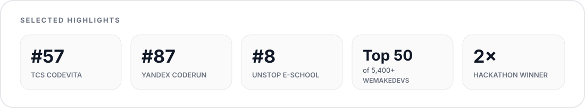

  <a href="https://rohanmalhotracodes.github.io/">Open portfolio ↗</a>

 

## Tools & Technologies

 

## GitHub at a glance

 

## Open source

<table>
  <tr>
    <td align="center" width="50%">
      
        
      <b>3+ merged PRs</b> · runtime · reliability · Kubernetes security
    </td>
    <td align="center" width="50%">
      
       
      <b>12+ merged PRs</b> · <b>14+ issues resolved</b> · full-stack + developer experience
    </td>
  </tr>
</table>

 

## Play Tic-Tac-Toe

  <a href="https://rohanmalhotracodes.github.io/tictactoe.html"><b>Play instantly ↗</b></a>

 

## Highlights

 

  <a href="https://rohanmalhotracodes.github.io/"><b>Visit my portfolio ↗</b></a>

