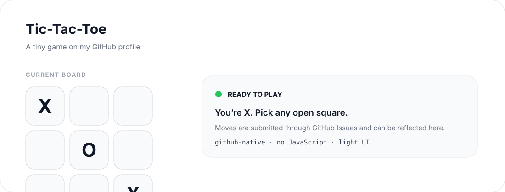

# Rohan Malhotra

**Computer Engineer · Open Source · Builder**

Building across developer tooling, product infrastructure and applied computer vision.

<a href="https://rohanmalhotracodes.github.io/">Portfolio ↗</a>

 

 

## GitHub stats

  
  

 

  

 

## Open source

| TrueForge / TrueFoundry | Oppia Foundation | Zulip |
|:---:|:---:|:---:|
| Product reliability, sandbox runtime, Kubernetes security, contributor UX | 12+ merged PRs · 14+ issues resolved | Developer experience & keyboard navigation |

 

## Play Tic-Tac-Toe

**Pick a square**

[↖](https://github.com/rohanmalhotracodes/rohanmalhotracodes/issues/new?title=tictactoe%3A0) · [↑](https://github.com/rohanmalhotracodes/rohanmalhotracodes/issues/new?title=tictactoe%3A1) · [↗](https://github.com/rohanmalhotracodes/rohanmalhotracodes/issues/new?title=tictactoe%3A2)  
[←](https://github.com/rohanmalhotracodes/rohanmalhotracodes/issues/new?title=tictactoe%3A3) · [●](https://github.com/rohanmalhotracodes/rohanmalhotracodes/issues/new?title=tictactoe%3A4) · [→](https://github.com/rohanmalhotracodes/rohanmalhotracodes/issues/new?title=tictactoe%3A5)  
[↙](https://github.com/rohanmalhotracodes/rohanmalhotracodes/issues/new?title=tictactoe%3A6) · [↓](https://github.com/rohanmalhotracodes/rohanmalhotracodes/issues/new?title=tictactoe%3A7) · [↘](https://github.com/rohanmalhotracodes/rohanmalhotracodes/issues/new?title=tictactoe%3A8)

[Reset board](https://github.com/rohanmalhotracodes/rohanmalhotracodes/issues/new?title=tictactoe%3Areset)

 

## Highlights

| **#57** | **#87** | **#8** | **Top 50 / 5,400+** | **2×** |
|:---:|:---:|:---:|:---:|:---:|
| TCS CodeVita | Yandex CodeRun | Unstop E-School Leaders | WeMakeDevs Hackathon | Hackathon winner |

 

### [Visit my portfolio ↗](https://rohanmalhotracodes.github.io/)

